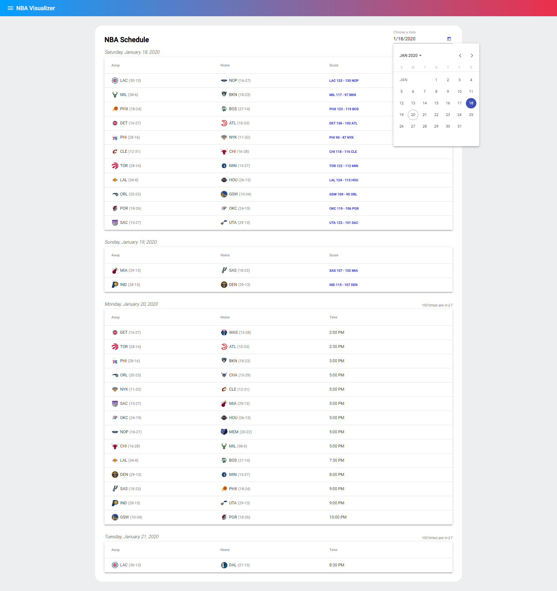

<p align="center">
  <a href="https://nba.pravinthan.com">
    
  </a>
</p>

<h1 align="center">
  <a href="https://nba.pravinthan.com">NBA Visualizer</a>
</h1>

> A web app dedicated to providing user-friendly NBA schedules, box scores, play-by-play data and more.

Check out the [schedule](https://nba.pravinthan.com/#/schedule) and you can click on the score to see preview and recap articles, full box score and play-by-play data.

## Table of contents

* [Running this project on a local machine](#running-this-project-on-a-local-machine)
* [Screenshots](#screenshots)
* [License](#license)

## Running this project on a local machine

Download this repository and run the following command to install all necessary node modules:

```sh
$ npm i
```

Then run the following command to build and serve the app:

```sh
$ npm run serve
```

## Screenshots

### Schedule


Can be accessed [here](https://nba.pravinthan.com/#/schedule).

### Box Score

Can be accessed by navigating to a live/completed game and clicking on the score.

### Play-by-Play

Can be accessed by navigating to a completed game and clicking on the score.

### Play-by-Play Video Highlights

Can be accessed by navigating to the play-by-play tab and clicking on a filled circle.

## License

[MIT](./LICENSE) © [Pravinthan Prabagaran](https://pravinthan.com).
